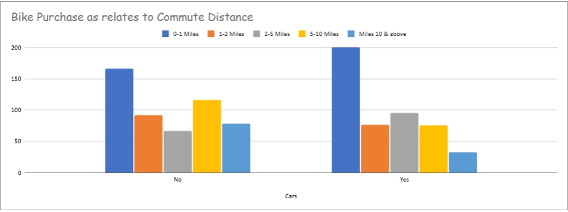
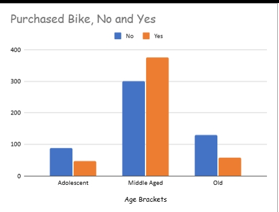
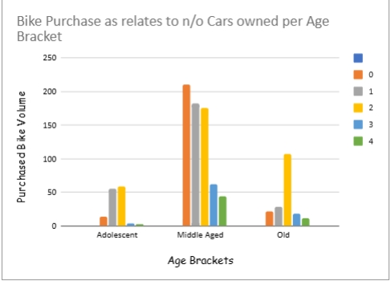

# 🚲 Bike Purchase Analysis with Google Sheets
This project analyzes consumer behavior around bike purchases using a dataset of 1,000 individuals. The analysis explores relationships between age, commute distance, car ownership, and purchase decisions. All data cleaning, pivoting, and visualization were done entirely in Google Sheets.

### 📂 Dataset
- **Source:** Kaggle
- **Fields:** Age, Gender, Region, Commute Distance, Number of Cars, Purchased Bike
- **Size:** 1,000 rows

### 🧹 Data Cleaning
To prepare the dataset for analysis, the following steps were performed in Google Sheets:

- **Removed duplicate rows** to ensure accuracy and avoid double-counting.
- **Created a new column for Age Groups** by categorizing raw age values into:
  - *Adolescent*  
  - *Middle Aged*  
  - *Old*
- **Standardized categorical values** so that age groups were consistent across the dataset.
- Verified that all entries in the "Purchased Bike" column were standardized to "Yes" or "No".
- Checked for and removed blank or inconsistent entries in key fields.

### 📊 Analysis

The dataset was analyzed using pivot tables, slicers, and charts in Google Sheets to uncover patterns in bike purchasing behavior. Key findings include:

- **Age Bracket vs Bike Purchase:**
  - Middle-aged individuals had the highest bike purchase rate.
  - Adolescents and older individuals showed lower purchase volumes.

- **Commute Distance vs Bike Purchase:**
  - People with shorter commute distances (especially 0–1 miles) were more likely to purchase bikes.
  - Bike purchases decreased as commute distance increased.

- **Car Ownership vs Bike Purchase:**
  - Individuals with **zero cars** were significantly more likely to purchase bikes.
  - Among middle-aged individuals, those without cars had the highest bike purchase volume.

### Visualization
- **Bike Purchases by Commute Distance**  
  
- **Bike Purchases by Age Brackets**  
  
- **Impact of Car Ownership on Bike Purchases**  
  

### Tools Used
- Google Sheets (Data cleaning, Pivot tables, Charts)

### Folder Structure
- `Excel Project Dataset.xlsx` — raw dataset
- `[Google Sheets link](https://docs.google.com/spreadsheets/d/1hDMrC3-eY92TLo0xaLx_yjHt1QklD2yX/edit?usp=drive_link&ouid=117323130776602956523&rtpof=true&sd=true)` — cleaned and analyzed workbook
- `Dashboard.png` — screenshot of final dashboard

